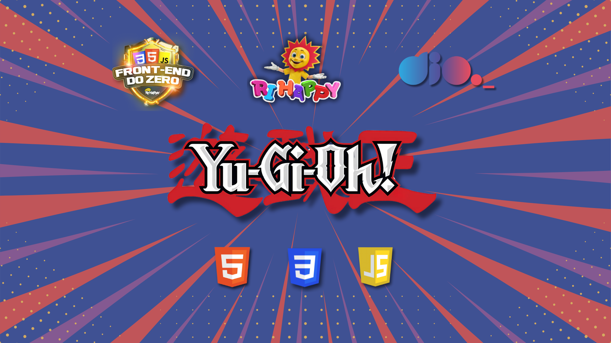

# 🎮 Yu-Gi-Oh | Jo-ken-po Edition 🎴

> Desafio de projeto proposto pelo expert Felipe Aguiar da plataforma [DIO](https://web.dio.me/) do bootcamp front-end do zero da Ri Happy. O objetivo desse projeto é criar um jogo Jo-Ken-po com o tema da franquia Yu-Gi-Oh, com HTML, CSS e JavaScript.

## 💻 Tecnologias usadas:

  
  
  

## 🖥 Preview do Jogo:

- Venha jogar acessando [aqui nesse link do GithubPages](https://codebytayne.github.io/js-yugioh/)

## ⚙ Execução do Jogo
1. **Clonar Repósitório:** basta utilizar o comando `git clone` para clonar esse projeto e salvar na máquina e depois executar o arquivo `index.html`.
2. **GitHubPages:** pode também acessar o projeto nesse [link](https://codebytayne.github.io/js-yugioh/), que abrirá esse projeto no GitHubPages, sem precisar baixar o repositório na sua máquina.

## 🕹 Como jogar
- O jogador jogará contra o computador.
- As cartas do computador o jogador não poderá ver, com isso o jogador deverá escolher uma das suas cartas analisando bem o atributo da carta.
- O jogo informa o nome e o atributo da carta.
- Caso a carta do jogador vence a carta do computador o placar do jogador (win) soma 1 ponto, caso perca, o placar do computador (lose) soma mais um ponto.
